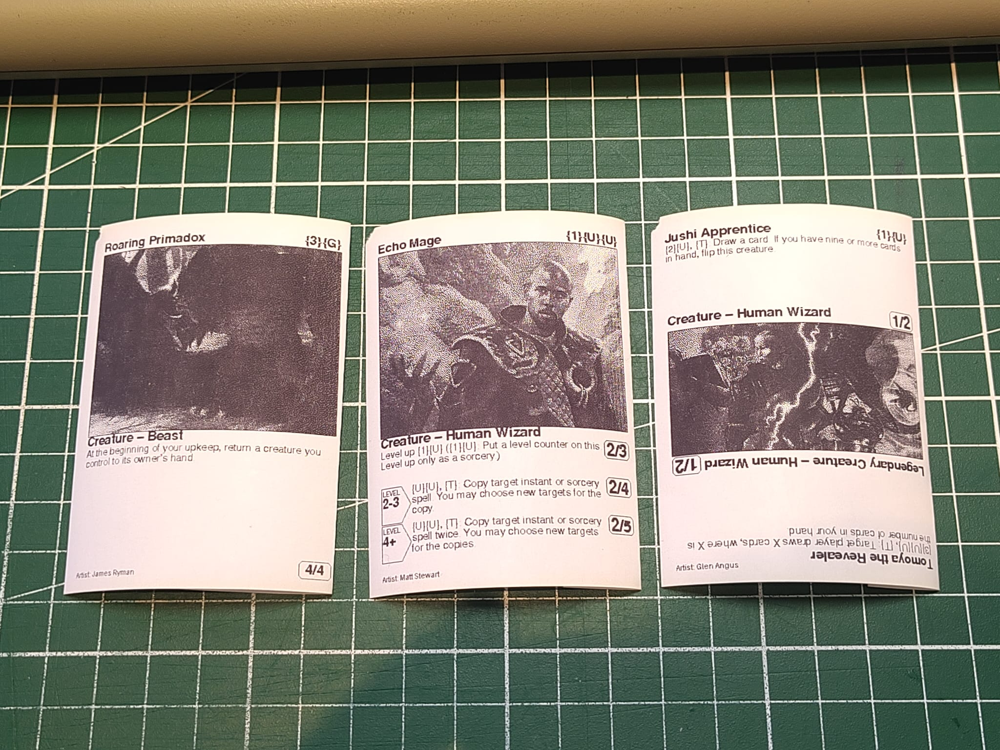
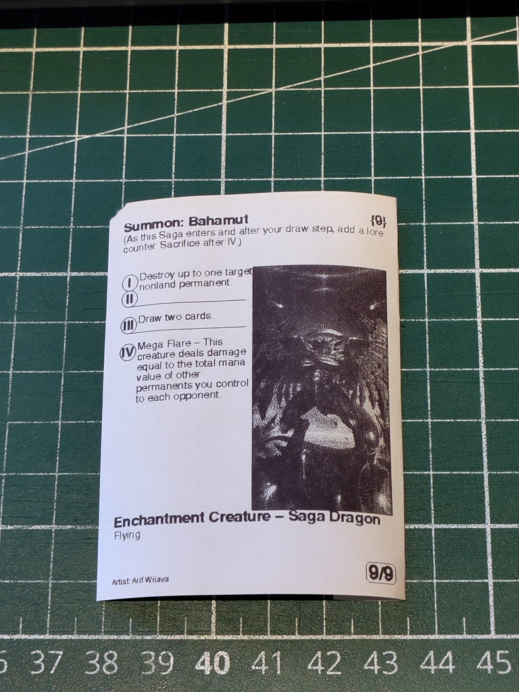
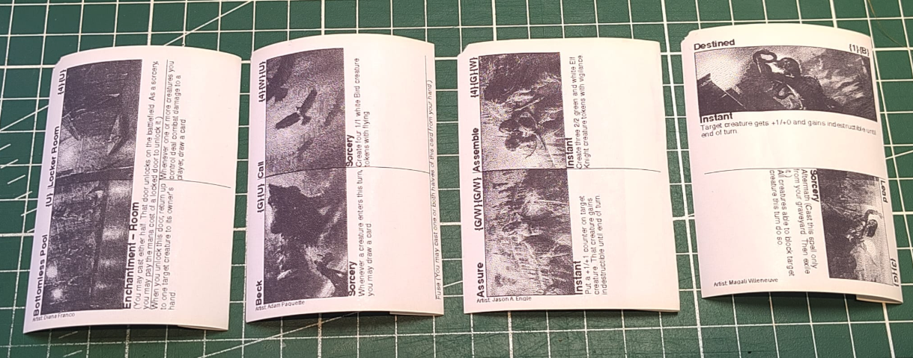
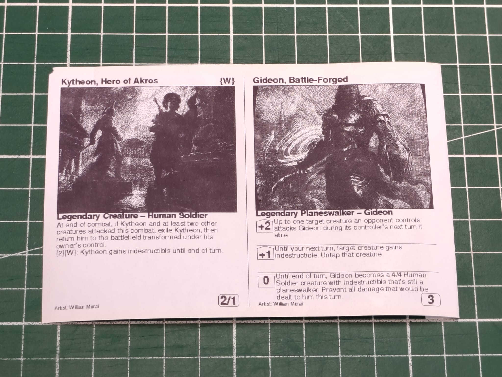
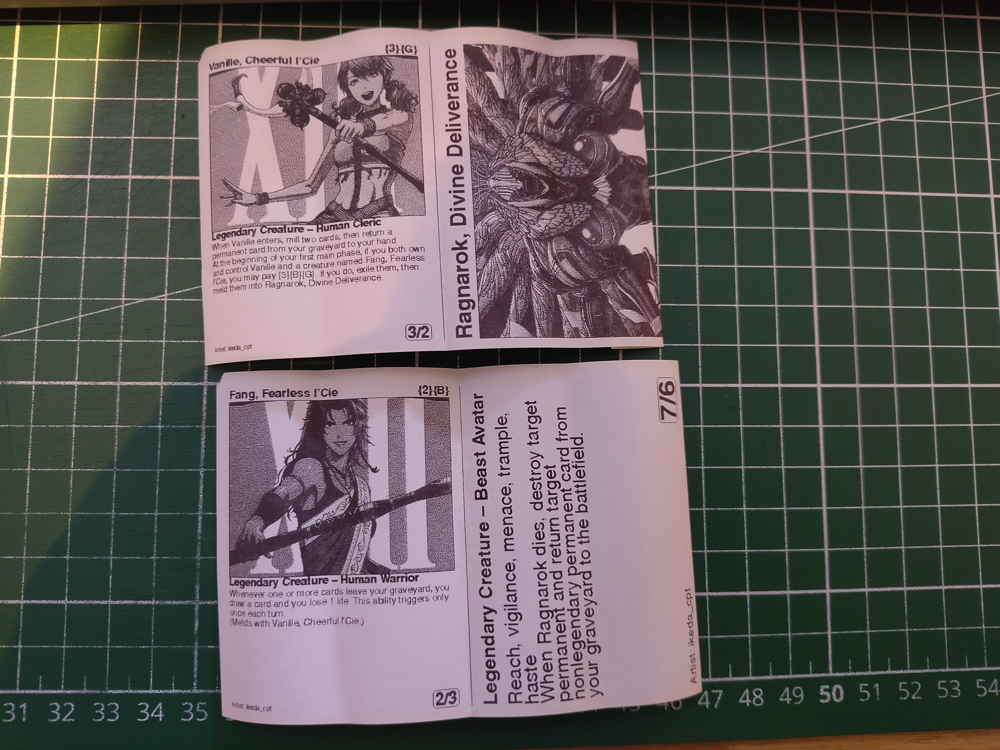

# Yet another momir printer
A python project to play 'Momir Basic' on paper through the magic of scryfall and a TM-T88V receipt printer

## Installation
To install all the required components run the following command:
```pip install -r requirements.txt```

From here you should be all set up to get randomized cards from the commandline.
To get a random card, plug in your Epson TM-T88V and use the following command:

```Python Momir x```

where x is your desired mana value

## Examples
The printer supports all nearly card layouts and aims to represent them as their official counterparts, excluding layouts exclusive to the 'un' sets.



This includes enchantments, enchantment creatures and the different types of split cards

 


Dual faced cards will have both sides printed on a single strip with a dividing line to fold over.



## Rest API
This printing library can also be run as a Rest-API by running:
```flask --app server.py run```

This exposes a rest api on `localhost:5000/api`.
For an example on how to use this api to print a full decklist check out `Decklist.py`

There is currently no API documentation available.
There also isn't a setup script or setup instructions for hosting this project on a raspberry pi.
If you'd still like to give that a shot I've included my personal notes about the setup process in `remote_notes.txt`.

## Features
 - Print randomized cards based on mana value and card type
 - Custom layouts, supporting nearly all card layouts (including dual faced and meld cards)
 - Optional web interface for convenient use on any device

## Future work
 - Local oracle database for offline play / whenever scryfall is slow
 - Setup Instructions for web interface on raspberry pi
 - API Documentation
 - Add arrows denoting flipsides for dual faced and modal dual faced cards